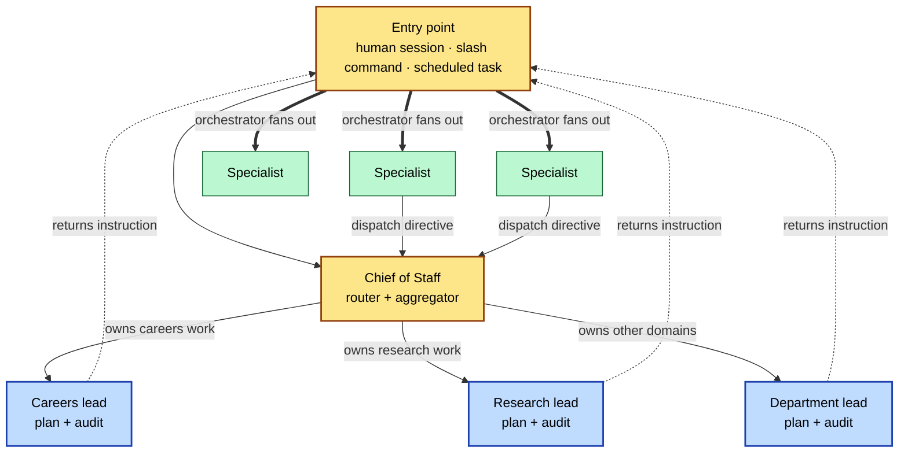
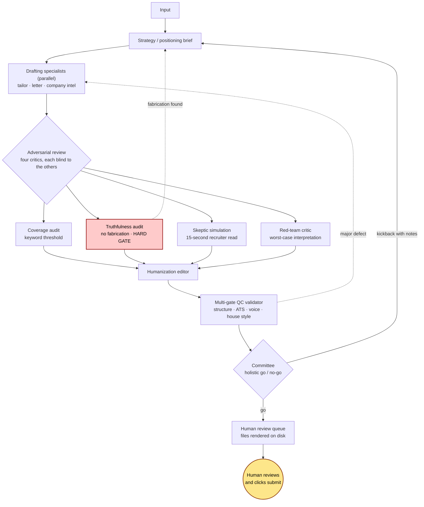
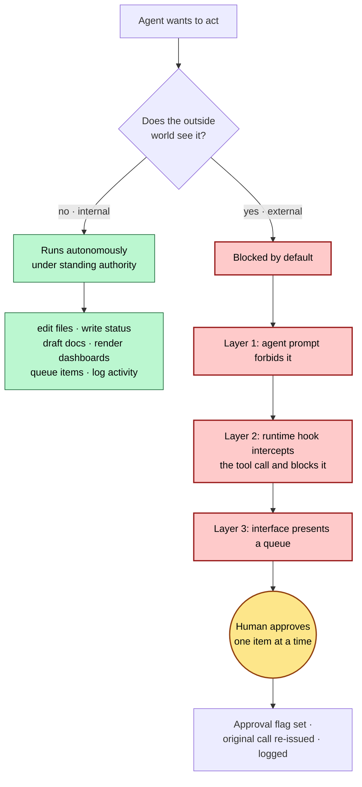
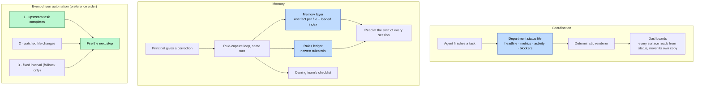
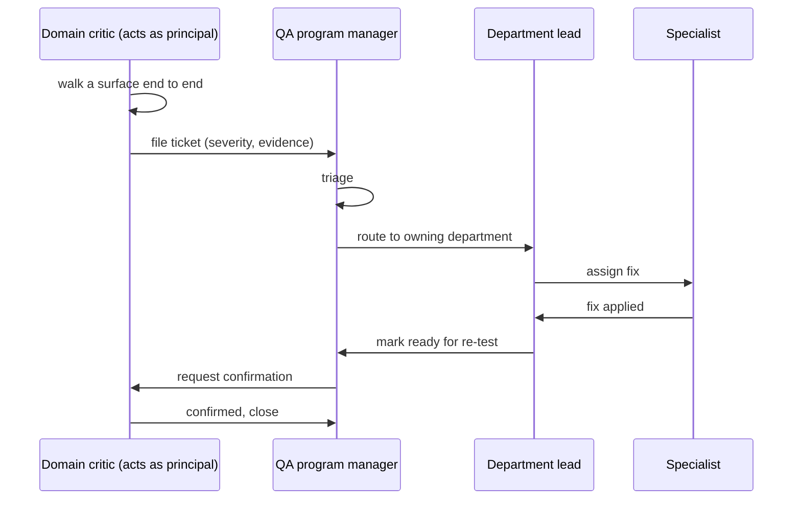
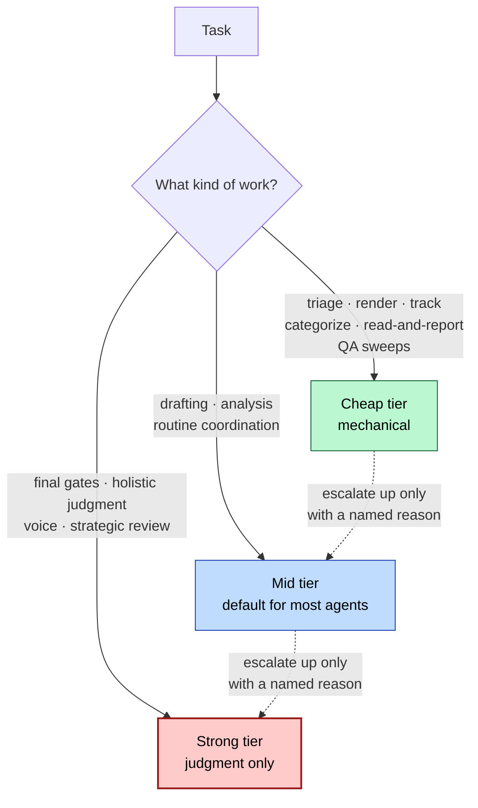

# Architecture

A deeper look at how the Executive Office is structured. Sanitized companion to the [README](./README.md).

This is a multi-agent operations system: 90+ agents across 12 departments, run on Claude Code, that draft, review, validate, and surface real day-to-day work. The design goal is not a clever demo. It is a system that stays correct over months of daily use and never takes an irreversible action on the principal's behalf without an explicit human click.

## The shape

```
Human (principal)
├── Chief of Staff ............ cross-department aggregation, daily brief, approval queue, dispatch routing
├── Executive Assistant ....... hour-by-hour task list, day-of nudges, quick lookups (peer to CoS)
├── Strategic Coach ........... advisory; reviews the whole system for drift and unused capability
├── Super-User QA ............. domain critics + a QA program manager file and route tickets
└── 12 Departments
    └── each: one lead + N specialists
```

The human is the only actor who performs irreversible external actions. Everything below drafts, prepares, validates, and surfaces.

## Departments

Each exposes the same contract: a status file (current state, metrics, recent activity, blockers) that the dashboards render from, and a lead that owns it.

| Department | Scope |
|---|---|
| Careers | A job-search pipeline end to end |
| Calendar | Scheduling, conflict resolution, meeting prep |
| Email | Inbox triage, draft replies, escalations |
| Communications | Voice and tone for all external writing |
| Lifestyle & Ops | Bills, travel, subscriptions, events |
| Fitness | Training plans, analytics, nutrition |
| Research | Deep-dive analysis on companies, people, decisions |
| Finance | Capital allocation, investment research, tax posture |
| Dashboard & Tools | The internal tooling and rendering pipeline |
| Learning | Curating and adopting workflow improvements |
| Social & Marketing | Content pipeline and cadence |
| Entrepreneur | Venture evaluation |

## 1 · Orchestration and dispatch

A request enters at the top of the call stack (a human session, a slash command, or a scheduled-task runner) and routes to the department that owns the work. The Chief of Staff is a router and aggregator, not a bottleneck: any agent can emit a dispatch directive naming a target department and agent, and the router passes the payload through verbatim to that specialist. Within-department handoffs route through the department lead instead of the Chief of Staff.



The load-bearing constraint is that **sub-agents cannot spawn sub-agents.** The runtime strips the dispatch tool from any agent spawned as a sub-agent, whatever its config claims. So a department lead cannot fan work out itself. It plans and audits, then returns a structured instruction for the orchestrator at the top of the stack to execute. Getting this wrong produces the worst kind of bug: a manager agent that appears to dispatch its team while the calls silently never fire. Making the boundary explicit in the architecture turned a whole class of silent no-ops into an impossible state.

Dispatch directives never trigger external actions on their own. They route work to a named agent; that agent then decides what to do, bound by its own approval rules. The routing layer moves work around; it does not bypass any gate. Malformed directives (a retired agent name, a target outside the department roster, more than a handful of dispatches in one turn) are halted and surfaced rather than executed.

## 2 · The adversarial review pipeline

The highest-stakes workflow follows an **attack then defend then validate then decide** shape. Work is drafted, handed to independent critics whose only job is to break it, humanized, validated against a multi-gate checklist, and finally judged as a whole before anything reaches the human. The concrete annotated run, including a truthfulness kickback and a QC kickback, is in [examples/pipeline-run-example.md](./examples/pipeline-run-example.md).



Two rules give this pipeline its integrity. First, **the agent that writes is never the agent that grades.** Optimism and skepticism are separated into different agents on purpose, because a single voice converges on its own blind spots. Second, **the truthfulness gate is the one no other agent can override.** Anything that would not survive interview cross-examination (an inflated metric, a borrowed pedigree, a claim of experience the candidate does not have) is rejected outright and looped back for a rewrite. A package advances only when it survives every gate and the committee; any kickback returns it to the relevant stage with notes attached rather than dropping it.

## 3 · The human-in-the-loop gate model

The system draws one bright line: internal mechanics run autonomously, and anything the outside world would see waits for an explicit human action. The gate is enforced in defense-in-depth so a single missed check cannot leak an external action.



| Category | Runs autonomously | Waits for the human |
|---|---|---|
| Editing internal files | yes | |
| Writing a department status file | yes | |
| Drafting a document or reply | yes | |
| Rendering dashboards | yes | |
| Queuing an item for approval | yes | |
| Submitting an application | | yes |
| Sending an email, message, or connection request | | yes |
| Posting to a social account | | yes |
| Writing to a calendar or moving money | | yes |

The middle layer is a runtime pre-tool-use hook: it inspects every tool call and blocks external side effects unless a per-action approval flag is present. Approving an item sets that flag, re-issues the originally blocked call, and logs it. The principal is the only actor who can flip that switch, and no amount of prompt-body confidence changes that, because the gate lives in code the agent does not control.

## 4 · State and memory architecture

Agents do not talk to each other through a shared conversation. They coordinate through durable files: a per-department status file that is the single source of truth for that department, a persistent memory layer of one-fact-per-file notes, and a canonical rules ledger that captures every standing correction. Automations are wired to fire on events rather than poll on a clock.



Three properties make this hold up over time.

- **Status freshness is a protocol, not a nicety.** Writing the status file is the last step of every workflow. A stale file is a stale dashboard, which is the moment the operator stops trusting the system, so freshness is treated as part of the work.
- **A correction made once becomes a standing rule.** When the principal corrects something, a capture loop lands it in three places in the same turn: the rules ledger, the memory layer, and the owning team's checklist. The ledger is authoritative and newest-rules-win, so nothing has to be re-litigated every session and the principal should never have to give the same correction twice.
- **Automations prefer completion triggers over file-watches over polling.** A recurring job that polls a clock wastes compute and, when it spawns agent work, wastes tokens. New automations fire when an upstream step finishes or when a watched file changes; a fixed interval is a grandfathered fallback, converted to event-driven when touched. A completion hook that syncs department status when a sub-agent stops, and session-start hooks that drain queued work, are examples of the same principle.

### Human-confirmed state is immutable to automation

A recurring background job once flipped human-confirmed records back to an earlier state because it could not tell them from its own stale writes. The fix is a write-guard with an asymmetric contract: it may heal a record (backfill missing provenance on something the human clearly did) but it may not demote a human-confirmed record to a lower state, ever. When in doubt, the guard trusts the human's signal, because losing a real confirmation costs far more than keeping a rare stray one. The revert path was deleted entirely, so it can no longer eat a real confirmation.

## 5 · The QA and super-user critic layer

Quality is not left to the teams that produce the work. A standing panel of domain critics sits outside every operational pipeline. Each critic acts as the principal for one surface, walks it end to end, and files tickets against anything that fails: a dead button, a number that does not reconcile across surfaces, an inert tile, a stale panel, a navigation dead-end. A QA program manager triages by severity, routes each ticket to the owning department lead, tracks it through its states, and closes it only when the critic confirms the fix. The principal is removed from this loop entirely; tickets reach the principal only through the daily brief.



The organizing principle across the whole system is that **the auditor is never the author.** It shows up at every level: the critic who files a ticket cannot edit the surface it audits and cannot fix its own ticket; the coverage, truthfulness, skeptic, and red-team critics in the pipeline are different agents from the drafters; the QC validator is separate from the writers; the committee that makes the final holistic call is separate again. A writer grades its own work too kindly, so grading is always someone else's job.

## 6 · Model-tier routing

Not every step deserves a frontier model. Each agent carries a default model tier chosen for the nature of its task, and the orchestrator spawns each agent at its default rather than reaching for the strongest model to be safe.



The policy is default-down, escalate-up. Mechanical work (triage, rendering, tracking, categorizing, read-and-report sweeps, the QA critics) runs on the cheap tier. Drafting, analysis, and routine coordination run on the mid tier, which most agents default to. The strong tier is reserved for judgment: final gates, the committee, voice, and strategic review. An agent escalates only for a specifically harder task, and the dispatch names the reason. Two supporting rules keep the bill honest: never spawn an agent for work that is only a handful of tool calls, since an agent re-loads context the caller already holds, and render or re-run expensive deterministic steps once per turn at the end rather than after every edit. This came directly from a run that burned close to a million sub-agent tokens because every agent ran on a frontier model regardless of task.

## The rendering pipeline

Dashboards are not hand-edited HTML. A deterministic renderer ingests every department's status file plus tracking data and emits the HTML surfaces. On every build it runs:

- A **number-tie audit**: every count must agree across every surface, or the build fails.
- An **interactivity audit**: every element that looks clickable must be wired, or the build fails.
- **Invariant checks**: domain rules (for example, "an item reaches the ready queue only if it passed both validation and committee") asserted at render time.

Creative judgment is model-driven; counting, joining, and asserting are plain code. The same deterministic-where-it-counts principle drives resume quality: every measurable rule is a hard gate in code that the pipeline runs, not a piece of prose an agent has to remember, because rules that live only as prose drift.

---
Sanitized for public showcase. The live system runs locally against private data.
