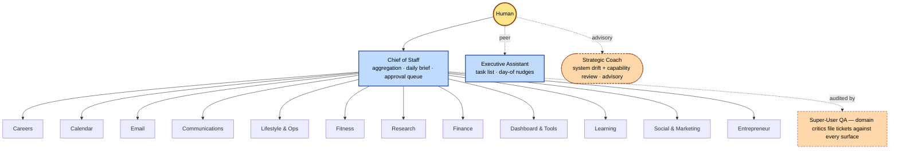
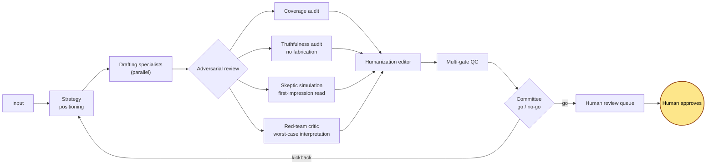

# Executive Office — a multi-agent AI operations system

A personal, production multi-agent system I designed and run on Claude Code. It turns a large language model into a coordinated operating team of 60+ specialized agents that handle real day-to-day workflows: planning, research, drafting, pipeline management, reporting, and review.

I am an operator, not an ML engineer. This is applied AI — orchestration, agent design, and workflow automation — built to be genuinely useful in daily work, with a human in the loop on anything that leaves the system.

| | |
|---|---|
| **Departments** | 12, each a self-contained team with its own lead and specialists |
| **Agents** | 60+, each with one clear role, its own instructions, and a scoped tool set |
| **Flagship pipeline** | A 14-stage drafting → adversarial review → validation → go/no-go workflow |
| **External actions** | Zero autonomous ones — every send and submit waits for a human click |
| **Substrate** | Claude Code sub-agents, hooks, scheduled tasks, MCP integrations, slash commands, file-based memory |

## What it does
- Runs structured workflows across departments (research, communications, operations, planning, and more), each staffed by purpose-built agents with narrow, well-defined responsibilities.
- Coordinates multi-step pipelines where work fans out to specialists in parallel, then is verified and synthesized before it reaches me.
- Maintains living state (status files, dashboards, durable memory) so the system has continuity across sessions.
- Surfaces decisions to me for approval. It drafts and prepares, but never sends or submits anything externally on its own.

## Architecture

A top-level coordinator dispatches work to department teams; each department has a lead (planner and auditor) and a set of specialists. Only the top of the call stack orchestrates — leads plan and validate, they do not fan out work themselves. That one boundary is the backbone of the system.

- **Orchestration layer:** a top-level coordinator dispatches tasks to specialized sub-agents and aggregates their output into a single decision-ready result.
- **60+ specialized agents**, each with one clear role, its own instructions, and a scoped tool set.
- **Slash commands:** repeatable entry points for common multi-agent workflows.
- **Hooks:** automated checks that fire at defined points to enforce the system's rules.
- **Scheduled tasks:** recurring jobs that keep the system current without manual triggering.
- **External integrations (MCP):** connections to outside tools and data sources.
- **Rendered dashboards:** generated HTML views of system state for at-a-glance review.

## The flagship workflow

The highest-stakes pipeline in the system follows an **attack → defend → validate → decide** shape. Work is drafted, then handed to independent critics whose only job is to find what is wrong with it, then humanized, validated against a multi-gate checklist, and finally judged as a whole before anything reaches me.

The agent that **writes** is never the agent that **grades**. Optimism and skepticism are separated into different agents on purpose. And the system that drafts an external message is structurally incapable of sending it.

## Design principles
- **Human in the loop.** The system drafts and prepares; a person approves and sends. No autonomous external actions.
- **Quality gates.** Independent drafting, adversarial review, and validation run before any output is considered done.
- **Single source of truth.** Invariant checks prevent state drift across the system's many files.
- **Honesty by construction.** Verification agents check every claim against ground-truth source material.

## Engineering decisions worth stealing

These generalize well beyond my use of them.

- **Planners are not orchestrators.** Sub-agents can't spawn sub-agents. A department lead plans and audits, then returns a structured instruction for the top-level context to execute. Conflating "manager" with "dispatcher" produces silent no-ops; making the boundary explicit fixed an entire class of failures.
- **Status freshness as a protocol.** Every department writes a status file after every meaningful action, and all dashboards render from those files. A stale file is a stale dashboard, so freshness is a rule, not a nicety.
- **Render-time invariants that fail loud.** Dashboards are regenerated by a deterministic pipeline that runs audits on every build — every count must agree across every surface, and every clickable element must be wired — or the build fails instead of shipping wrong numbers.
- **Human-confirmed state is immutable to automation.** When a person marks something done, no background job may silently revert it. The reconciler can heal missing data but is structurally incapable of demoting a human's confirmed action.
- **Determinism where it counts.** Creative judgment is model-driven; counting, joining, rendering, and auditing are plain code. A language model is a poor database.

## Stack
Claude Code (sub-agents, slash commands, hooks, scheduled tasks, MCP integrations), Python (state rendering and audits), Markdown and JSON for state and memory.

See [`examples/`](./examples) for sanitized agent and workflow definitions, and [ARCHITECTURE.md](./ARCHITECTURE.md) for a deeper look at the design.

## A note on scope
This repository is an architecture and patterns showcase. The running system operates on private data that lives locally and is never committed — what's here is the design, not the data.

---
Built and maintained by Kyle Littlejohn. Applied-AI orchestration and workflow automation — not model training or ML engineering.
