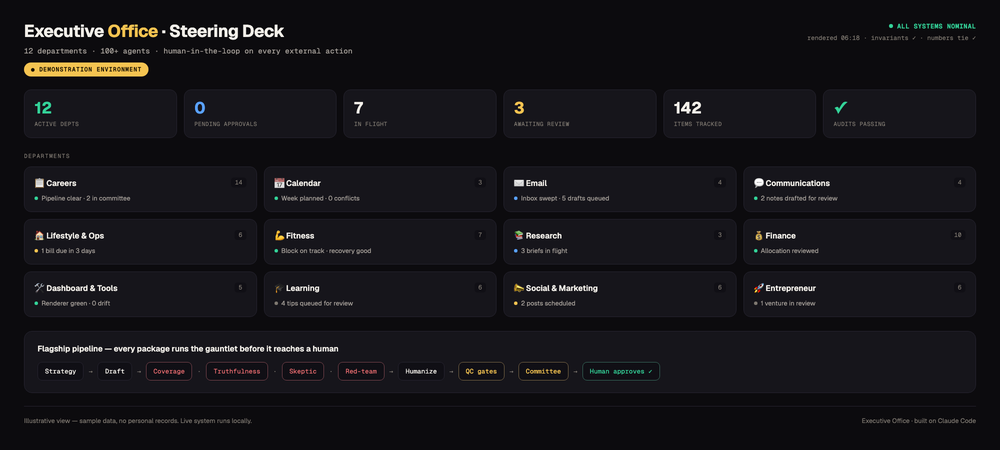
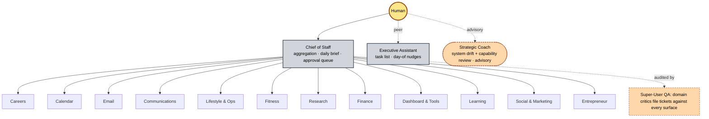

# Executive Office: a human-governed AI operating system for executive execution

For 12+ years I have been the Chief of Staff and Strategy & Operations leader who builds the operating systems other organizations run on. Naturally, I built one for my own.

The Steering Deck: one glance across all 12 departments. This is a demonstration environment built with sample data, no personal records, ever. The live system renders from real state files locally and never commits private data; source for this demo view is at <a href="docs/source/steering-deck-demo.html">docs/source/steering-deck-demo.html</a>.

## 1. The problem

Executive work is coordination-bound, not effort-bound. The scarce resource in a Chief of Staff or Strategy & Operations seat is never labor. It is attention: which of twenty open threads gets the next decision, which number is actually true right now, which draft is ready to leave the building.

Most AI tooling answers the wrong question. It makes a single task faster (a summary, a draft, a search) without changing who is accountable for the decision that follows it, and without changing how the operator tracks what still needs one. A faster draft that lands in an inbox nobody is watching is not leverage. It is another open thread.

I built Executive Office to answer the question executive work actually asks: not "can a model do this task," but "can a system carry the coordination load of a real operating cadence and still put every consequential decision in front of a human before it leaves the building." That is an operating model question, not a tooling question, and it needed an operating model answer.

## 2. Operating philosophy

Four principles, load-bearing across every department in this repo.

- **Attention is the scarce resource, not effort.** The system's job is to protect one thing: what the operator looks at next. Everything else, drafting, research, reconciliation, tracking, exists to keep that one queue short and honest.
- **Reality over system.** A smaller system that produces real-world movement beats a larger system that produces internal activity. Dashboards, agent counts, and pipelines are not the point. Decisions made and outcomes shipped are the point.
- **One queue per decision.** Every decision type (approve, send, submit, review) has exactly one place it surfaces, rendered from one source of state. Two queues for the same decision is how things get missed or done twice.
- **A human on every decision that leaves it.** The system drafts and prepares without limit. It does not act on the outside world without a person choosing to. This is not a caution added on top; it is a structural property enforced at three independent layers (prompt, hook, interface), so no single missed check can leak it.

## 3. Architecture

The system is organized as four planes, the same separation an executive would recognize from running a company rather than from running software.

- **Strategy** decides what and whether. Principles, standing rules, and judgment calls that outlive any single task. This plane sets direction; it does not touch execution directly.
- **Execution** produces the work. Departments organized around real functions (careers, calendar, email, communications, finance, research, and more), each with a lead who plans and audits and a set of specialists who do the work. 12 single-threaded owners with hard gates: one lead per department, so accountability for a domain's output never splits across two owners, and no department's output reaches the next plane without clearing its gate.
- **Measurement** remembers and verifies. State files, ledgers, and dashboards that every department writes to and every surface renders from, so there is one number for anything that gets counted, and a durable record of what actually happened.
- **Interface** is the only plane a human spends attention on. A daily brief, a single approval queue, and interrupts reserved for what actually needs a decision now. Nothing reaches the operator except through here, and nothing leaves the system except through a decision made here.

Work flows in one direction: strategy sets the spec, execution produces against it, measurement records what happened, interface surfaces the one decision that matters next, and the operator's decision flows back in as new data. No plane skips ahead, and nothing reaches a human except through the interface plane.

Each of the 12 departments has a lead who plans and audits, and a bench of specialists, 100+ across the system, who each hold one clearly scoped job. The agent count is a scale fact about how the execution plane is staffed, not the design itself: the design is the four planes, the single-owner departments, and the gates between them. A system with 500 undifferentiated agents and no gates would be a worse system than this one with a tenth as many.

The substrate underneath: Claude Code sub-agents, hooks, scheduled tasks, MCP integrations, slash commands, and file-based memory. See [ARCHITECTURE.md](./ARCHITECTURE.md) for the full diagrammed deep dive, including the flagship attack-defend-validate-decide pipeline.

## 4. Governance

Governance is the part of this system that makes the rest of it trustworthy, and it operates the same way good governance operates inside an organization: rules that hold under pressure, not rules that hold only when nobody is checking.

- **Gates.** Nothing external ships without a human clicking send. The highest-stakes pipeline follows an attack-defend-validate-decide shape: work is drafted, handed to independent critics whose only job is to find what is wrong with it (a coverage audit, a truthfulness audit that rejects anything that would not survive interview cross-examination, a skeptic simulation, a red-team critic), then humanized, checked against a multi-gate validator, and judged as a whole by a committee before it ever reaches a human review queue. The agent that writes a piece of work is never the agent that grades it.
- **Receipts.** Every meaningful action leaves a record: a status file, a ledger entry, a dated artifact. Claims about what happened are checked against a proof ledger before they go public, and a claim without a documented mechanism does not ship at full confidence; it gets flagged and either substantiated or softened at the next place it appears.
- **Same-turn rule capture.** When a new standing rule gets set, it gets written down in the same working session, not filed for later. A rule that lives only in memory until someone remembers to codify it is a rule that will eventually get missed; a rule captured the moment it is set is a rule the system can actually enforce going forward.
- **Adversarial self-audit.** The system runs critics against its own output on a schedule, not only when something looks wrong. Domain critics file tickets against every surface as a standing practice, on the premise that a system that only checks itself when prompted will eventually stop checking itself at all.

## 5. Lessons learned

Three incidents from the system's operating record, written as management lessons rather than engineering postmortems.

**The measurement layer overruled the operator's diagnosis, and that was the point.** Running the system's own career pipeline, I diagnosed a cadence as collapsed and started building a response around that number. The measurement layer I had built then contradicted me: the real weekly data showed the collapse had already begun recovering, and my figure had come from a stale copy of a log and a wrong week boundary. The response was to log the correction against my own analysis, in writing, the same night, then repair the data path structurally so the two sources could not diverge again. The lesson: the measure of an operating leader is not being right, it is building systems that catch you being wrong, and updating in public when they do. A governance system that only ever confirms the operator's instincts is not governance.

**A silent split in the source of truth cost real work before it was caught, and the fix was structural, not procedural.** An operational log had split into two paths without anyone deciding that should happen, and fourteen legitimate records were sitting in the path nobody was reading from before the split was found and the records recovered. The tempting fix is a reminder to check both paths. The actual fix was to make the split impossible: the secondary path became a symlink to the primary, so there is structurally one file, not two files someone has to remember to keep in sync. The lesson: when a process failure is really a structure failure, fix the structure. A rule that depends on someone remembering will eventually meet the day they do not.

**A scoring model earned trust by being tested against outcomes it had never seen, not by looking reasonable.** Before a new priority-scoring model went live, it was run back against the system's own historical record: real interview outcomes against real rejections. The model was not adjusted until it fit; it was checked once, cold, and it separated the two populations by a wide, consistent margin, with the one low-scoring exception being a case where the underlying data genuinely was thin, which is the correct behavior, not a bug. The lesson: a model, a rubric, or a person's judgment earns "trust it going forward" from a calibration test against real outcomes, not from sounding sensible in the room where it was designed.

## 6. Metrics

| | |
|---|---|
| **Departments** | 12, each a self-contained team with its own lead and specialists |
| **Agents** | 100+, each with one clear role, its own instructions, and a scoped tool set |
| **Flagship pipeline** | A 14-stage drafting to adversarial review to validation to go/no-go workflow |
| **External actions** | Zero autonomous ones; every send and submit waits for a human click |
| **Substrate** | Claude Code sub-agents, hooks, scheduled tasks, MCP integrations, slash commands, file-based memory |
| **Control surface** | 30+ slash commands; 20+ recurring scheduled jobs (overnight sourcing, briefs, self-audits) |
| **Operating scale** | Run daily for months, across thousands of recorded agent sessions and growing |

A note on the last row: an earlier version of this table cited a specific agent-turn count. That figure is under re-verification against the system's own session logs and is not repeated here until it clears the same proof standard the rest of this repo holds itself to. The department, agent, pipeline, and control-surface counts above are all directly inspectable in this repo.

## 7. What's here

| Document | What's inside |
|---|---|
| [ARCHITECTURE.md](./ARCHITECTURE.md) | The deep dive: orchestration and dispatch, the adversarial review pipeline, the human-in-the-loop gate model, state and memory, the QA critic layer, and model-tier routing. Six diagrams. |
| [docs/AGENT-CATALOG.md](./docs/AGENT-CATALOG.md) | The complete roster across 12 departments, leadership, and the QA team, each agent with its single job. |
| [docs/PIPELINE.md](./docs/PIPELINE.md) | The 14-stage work pipeline, stage by stage. |
| [docs/PATTERNS.md](./docs/PATTERNS.md) | Six engineering patterns worth stealing, with the failures that produced them. |
| [examples/](./examples) | Sanitized, runnable-shaped examples, including [a full pipeline run](./examples/pipeline-run-example.md) with a real truthfulness-gate kickback: an agent, a critic, a slash command, a hook, a scheduled task, a status file. |

### What it produces

This isn't a demo. It ships real, dated artifacts every day, all rendered locally from private state (nothing here is committed). A sampling of the output:

- **A daily executive brief**. A cross-department morning rollup: what each team did overnight, what needs a decision, what's due. One read to run the day.
- **Mission Control**. The dashboard above: every department's status, the pending-decision queue, and a live "what's left today" action hub. Regenerated on every change with hard invariant checks: every count must tie across every surface, or the build fails loud instead of shipping a wrong number.
- **Decision-ready work packages**. Each one drafted, adversarially reviewed, truthfulness-audited, humanized, and committee-approved through the 14-stage pipeline before it ever reaches me.
- **Living trackers**. Per-domain dashboards (pipeline, outreach, calendar, finance, training) that stay current because every agent writes its state after every action, and a shared completion layer so a thing marked done in one surface is done everywhere.
- **Drafts staged for one-click approval**. Outreach, replies, briefs, prep docs. The system prepares and surfaces; a human approves and sends. Nothing autonomous reaches the outside world.

### Engineering decisions worth stealing

These generalize well beyond my own use of them.

- **Planners are not orchestrators.** Sub-agents can't spawn sub-agents. A department lead plans and audits, then returns a structured instruction for the top-level context to execute. Conflating "manager" with "dispatcher" produces silent no-ops; making the boundary explicit fixed an entire class of failures.
- **Status freshness as a protocol.** Every department writes a status file after every meaningful action, and all dashboards render from those files. A stale file is a stale dashboard, so freshness is a rule, not a nicety.
- **Render-time invariants that fail loud.** Dashboards are regenerated by a deterministic pipeline that runs audits on every build: every count must agree across every surface, and every clickable element must be wired, or the build fails instead of shipping wrong numbers.
- **Human-confirmed state is immutable to automation.** When a person marks something done, no background job may silently revert it. The reconciler can heal missing data but is structurally incapable of demoting a human's confirmed action.
- **Determinism where it counts.** Creative judgment is model-driven; counting, joining, rendering, and auditing are plain code. A language model is a poor database.

### Stack
Claude Code (sub-agents, slash commands, hooks, scheduled tasks, MCP integrations), Python (state rendering and audits), Markdown and JSON for state and memory.

See [`examples/`](./examples) for sanitized agent and workflow definitions, and [ARCHITECTURE.md](./ARCHITECTURE.md) for a deeper look at the design.

### A note on scope
This repository is an architecture and patterns showcase. The running system operates on private data that lives locally and is never committed. What's here is the design, not the data.

---
Built and maintained by Kyle Littlejohn. Applied-AI orchestration and workflow automation, not model training or ML engineering.
